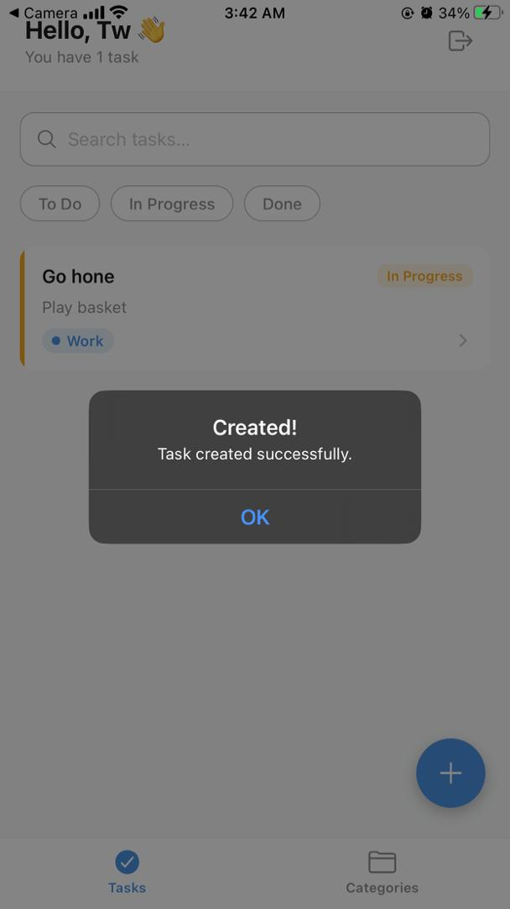

# Task Manager

A simple mobile task manager built with React Native and Expo, backed by a small Next.js API. The app lets users sign in, create tasks, edit task details, organize work into categories, and track status from one place.

## App Title and Short Description

**Task Manager** is a mobile app for managing personal and work tasks. It includes login, task lists, task details, task creation/editing, category management, and search/filter options.

## Chosen Domain and Main Entities

### Domain
Task and category management for personal productivity.

### Main Entities

- **User**
  - `id`
  - `name`
  - `email`
  - `password` (stored hashed in the backend)
  - `createdAt`

- **Task**
  - `id`
  - `title`
  - `description`
  - `status` (`todo`, `in-progress`, `done`)
  - `categoryId`
  - `userId`
  - `createdAt`
  - `updatedAt`

- **Category**
  - `id`
  - `name`
  - `color`

## State Management Approach

The app uses **React Context API + `useReducer`** in `store/AppContext.js` and `store/reducer.js`.

This approach was chosen because:

- It is simple and easy to understand for a small project.
- It keeps global data like user auth, tasks, categories, and filters in one place.
- It avoids passing props through many screens.
- It works well with the app structure without needing a heavier library like Redux.

The app also uses **AsyncStorage** to keep the login session and the last active filter after app restart.

## Backend Details

### Technology / Service Used

- **Next.js API routes** for the backend
- **JSON file storage** in `backend/data/db.json` for local development
- **JWT** for authentication
- **bcryptjs** for password hashing

### Main Endpoints

#### Auth
- `POST /api/auth/login` - login with email and password
- `POST /api/auth/register` - create a new user account

#### Tasks
- `GET /api/tasks` - get the current user's tasks
- `POST /api/tasks` - create a new task
- `GET /api/tasks/[id]` - get one task by id
- `PATCH /api/tasks/[id]` - update a task
- `DELETE /api/tasks/[id]` - delete a task

#### Categories
- `GET /api/categories` - get all categories
- `POST /api/categories` - create a category
- `PUT /api/categories/[id]` - update a category
- `DELETE /api/categories/[id]` - delete a category

## Setup Instructions

### Install Dependencies

Install the mobile app dependencies from the project root:

```bash
npm install
```

Install the backend dependencies:

```bash
cd backend
npm install
```

### Run the App

Start the mobile app from the project root:

```bash
npm start
```

You can also run:

```bash
npm run android
```

or

```bash
npm run ios
```

if your environment supports it.

### Run or Connect to the Backend

Start the backend server:

```bash
cd backend
npm run dev
```

The backend runs on port `3001`.

For a physical device, set the Expo API URL to your computer's LAN IP in the root `.env` file:

```bash
EXPO_PUBLIC_API_URL=http://YOUR_LAN_IP:3001/api
```

Example:

```bash
EXPO_PUBLIC_API_URL=http://10.2.26.164:3001/api
```

## Known Limitations / Incomplete Features

- The backend uses a JSON file instead of a real database.
- It is meant for local development, not production use.
- The app depends on the backend being available on the correct LAN IP when testing on a real phone.
- There is no image upload feature.
- There is no password reset flow.
- The current project does not include a production deployment setup.

## Screenshots / Short Screen Recording




## Short Report Summary

This project is a small task manager app made with Expo and React Native. It uses a simple global state setup with Context and a reducer, and a Next.js backend with JWT login and JSON file storage. The app covers the main workflow of signing in, viewing tasks, creating tasks, editing tasks, and managing categories.
